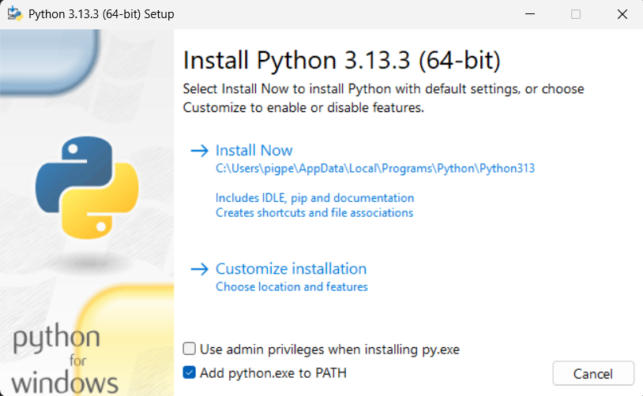

# The Library of Congress API in Python (for CSCI 105)

This repository was created for working with the Civil Rights History Project, found here:
https://www.loc.gov/collections/civil-rights-history-project/

Below are some instructions for using the Python package:

---
## **For those who don't have Python installed:**

If you don't have Python installed on your machine, you won't be able to use the package.

#### **Install python**
1. You can download the latest version of python from [Python.org](https://www.python.org/downloads/)
2. If you are not using windows, I recommend that you find a YouTube tutorial, as I am a windows user. For windows users:
    1. Locate the .exe file and open it.
     
    2. Follow the directions in the installer. (Make sure to check 'Add python.exe to PATH') and pick Install Now
        - You may need to use admin privileges
        
3. Open your terminal. To verify that python and pip is installed properly do the following:
    - Test the commands that invoke the interpreter (Any of the below)
    ```powershell
    python
    ```
    
    ```powershell
    py
    ```
    - If the above works, you should see something like this:
    ```Output
    PS C:\Users\pigpe> python
    Python 3.13.3 (tags/v3.13.3:6280bb5, Apr  8 2025, 14:47:33) [MSC v.1943 64 bit (AMD64)] on win32
    Type "help", "copyright", "credits" or "license" for more information.
    >>> 
    ```
    - Type `exit()` to exit the interpreter, or you can type any valid expression to execute python code
    - After exiting, use the following:
    ```powershell
    pip
    ```
    - The output should look like:
    ```Output
    PS C:\Users\pigpe> pip
    
    Usage:
      pip <command> [options]
    
    Commands:
      install                     Install packages.
      download                    Download packages.
      uninstall                   Uninstall packages.
      freeze                      Output installed packages in requirements format.
      inspect                     Inspect the python environment.
      list                        List installed packages.
      show                        Show information about installed packages.
      check                       Verify installed packages have compatible dependencies.
      config                      Manage local and global configuration.
      search                      Search PyPI for packages.
      cache                       Inspect and manage pip's wheel cache.
      index                       Inspect information available from package indexes.
      wheel                       Build wheels from your requirements.
      hash                        Compute hashes of package archives.
      completion                  A helper command used for command completion.
      debug                       Show information useful for debugging.
      help                        Show help for commands.
    
    General Options:
      -h, --help                  Show help.
      --debug                     Let unhandled exceptions propagate outside the main subroutine, instead of logging them
                                  to stderr.
      --isolated                  Run pip in an isolated mode, ignoring environment variables and user configuration.
      --require-virtualenv        Allow pip to only run in a virtual environment; exit with an error otherwise.
      --python <python>           Run pip with the specified Python interpreter.
      -v, --verbose               Give more output. Option is additive, and can be used up to 3 times.
      -V, --version               Show version and exit.
      -q, --quiet                 Give less output. Option is additive, and can be used up to 3 times (corresponding to
                                  WARNING, ERROR, and CRITICAL logging levels).
      --log <path>                Path to a verbose appending log.
      --no-input                  Disable prompting for input.
      --keyring-provider <keyring_provider>
                                  Enable the credential lookup via the keyring library if user input is allowed. Specify
                                  which mechanism to use [auto, disabled, import, subprocess]. (default: auto)
      --proxy <proxy>             Specify a proxy in the form scheme://[user:passwd@]proxy.server:port.
      --retries <retries>         Maximum number of retries each connection should attempt (default 5 times).
      --timeout <sec>             Set the socket timeout (default 15 seconds).
      --exists-action <action>    Default action when a path already exists: (s)witch, (i)gnore, (w)ipe, (b)ackup,
                                  (a)bort.
      --trusted-host <hostname>   Mark this host or host:port pair as trusted, even though it does not have valid or any
                                  HTTPS.
      --cert <path>               Path to PEM-encoded CA certificate bundle. If provided, overrides the default. See 'SSL
                                  Certificate Verification' in pip documentation for more information.
      --client-cert <path>        Path to SSL client certificate, a single file containing the private key and the
                                  certificate in PEM format.
      --cache-dir <dir>           Store the cache data in <dir>.
      --no-cache-dir              Disable the cache.
      --disable-pip-version-check
                                  Don't periodically check PyPI to determine whether a new version of pip is available for
                                  download. Implied with --no-index.
      --no-color                  Suppress colored output.
      --no-python-version-warning
                                  Silence deprecation warnings for upcoming unsupported Pythons.
      --use-feature <feature>     Enable new functionality, that may be backward incompatible.
      --use-deprecated <feature>  Enable deprecated functionality, that will be removed in the future.
    PS C:\Users\pigpe> 
    ```
    - If your terminal looks something like the above, then python should be properly installed!
---
## **Set up a virtual environment (_Highly Recommended_)**

A virtual environment isolates dependencies, and lets you experiment without messing up your global python environment.
Also, your global python installation will be probably be nested deep within your files, and you don't really want to move it, but the virtual environment can be kept close to where you are working, so you can easily access it any time.

1. Pick a directory for you new virtual environment:
    - It should be easy to find
    - It's name should contain no spaces (For simplicity)
    - If you use an IDE that can be used for python (such as Visual Studio Code), you might put the environment where your IDE can find it
2. Navigate to the chosen directory:
    - You can use `cd <directory>` to change to a directory, or `cd ..` to go to the parent directory
    - On windows, you can also open the folder in the File Explorer and right-click in the folder to Open in Terminal
3. **Create the virtual environment**: In your terminal, use:
    - On windows: `python -m venv <The Name For Your New Virtual Environment Here>`
    - On macOS/Linux: `python3 -m venv <The Name For Your New Virtual Environment Here>`
    - **Replace `<The Name For Your New Virtual Environment Here>` with the name you want to give the virtual environment!**
4. **Activate the virtual environment**: In your terminal, use:
    - On windows: `.\<virtual environment name>\Sctipts\activate`
    - On macOS/Linux: `source <virtual environment name>/bin/activate`
    - **Replace `<virtual environment name>` with the name you gave your virtual environment!**
5. **Do not kill the terminal, or you will have to activate the virtual environment again!**
6. _You can deactivate your virtual environment by using_:`deactivate`
---
## **Get the code**
1. Download a zip file
2. Move it to your workspace
3. Extract the contents
4. Take the `locpy` folder out of `LoC-API-in-Python`
5. In the terminal, navigate to your workspace
6. Invoke the python interpreter (Using `python` or `python3`)
7. Add the following line and press enter:
```python
from locpy import *
```
8. If you don't have the requirements installed, you will be prompted before attempting to install them
9. The script should then begin running:
    1. Sends 7 requests to the Library of Congress, taking about 30-40 seconds
    2. Trims the received json files
    3. Creates 157 instances of the EntryData class
    4. Pickles the data in `DATA.pkl`
    5. Unpickles the data in `DATA.pkl` and exports the EntryData class
10. To confirm that it worked, run this:
```python
print(EntryData)
```
11. The output should show the following features: (It will be very long!)
```json
{
    "title_instances":{
        "<A title in the dataset>":"EntryData(<The index of the instance>)",
    },
    "index_instances":{
        "<An index>":"EntryData(<The index of the instance>)",
    },
    "index_title":{
        "<An index>":"<The title that index refers to>",
    }
}
```
12. If you have internet connection, paste this into the python shell to try printing a transcript:
```python
from locpy import EntryData # Imports EntryData after setting up

# Entry gets an instance of EntryData. 
# The '.entry' method retrieves an item from the dataset.
Entry = EntryData.entry(1)

# We get the transcript, save it, and open the file to read
with Entry.open("test.txt",'w') as file:
    for line in file:
        print(line,end='')


```
---

## **Useful Documentation**

The instances of `EntryData` have many methods:
- `__iter__`: Allows iteration over the keys in the json data
```python
from locpy import EntryData

Entry = EntryData.entry(1)

print(*list(Entry))
```
Will print:
```text
access_restricted aka campaigns contributor date dates digitized extract_timestamp group hassegments id image_url index item language location mime_type number number_carrier_type number_former_id number_lccn number_source_modified online_format original_format partof resources segments shelf_id site subject timestamp title type url

```
- `__getitem__`: Accesses a value in the json
```python
from locpy import EntryData

Entry = EntryData.entry(1)

print(Entry['location'])
```
Will print:
```
["United States", "New York (N.Y.)"]

```
- `keys`, `values`, and `items`: Calls these `dict` methods on the json
- `make_json`: Writes the instance's json to the given filename.
- `__str__`: Prints the instance's index and name (title)
- `__repr__`: Prints `EntryData.entry(<index of instance>)`
- `entry`: Given part of a title or an integer, returns the associated instance
- `get_transcript`: When called on an instance, saves the associated transcript to the given filename. If the file does not exist, it is created. If the file already exists, it is wiped upon opening.
- `read_transcript`: Given a filename, opens that file for reading. It reads the first line to get the encoding, then reconfigures it if neccessary. Returns an open file.
- `open`: This is `EntryData.open`, not to be confused with `io.open`, the builtin function. `EntryData.open` takes 3 arguments:
    1. self_or_cls: If you called it like `EntryData.open()`, this is set to the class. If you call it on an instance `Entry.open()`, this is set to that instance. You must call on an instance to get a transcript with this method.
    2. filename: The name of the file you want to interact with
    3. get_new: Defaults to False:
        - If False: This is the same as calling `EntryData.read_transcript(filename)`
        - If True: Calls `self_or_cls.get_transcript(filename)` to save a transcript, then calls `EntryData.read_transcript(filename)` to return a open file in reading mode.
